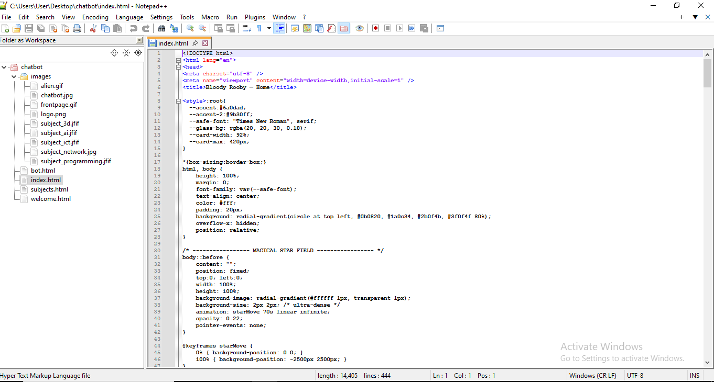
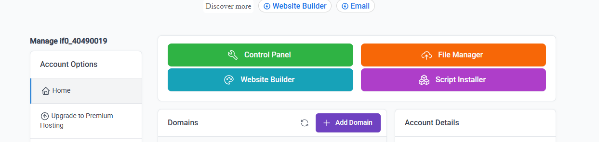
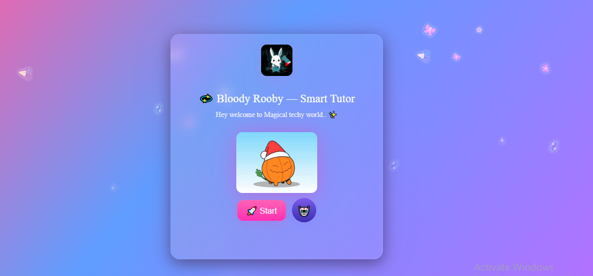
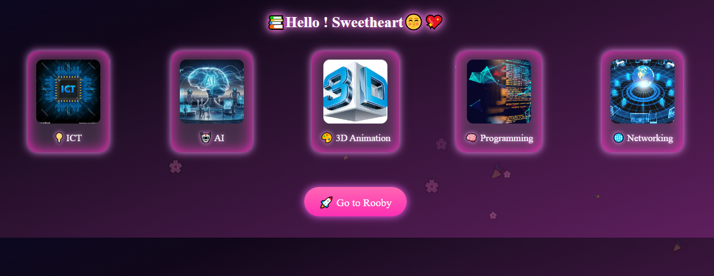
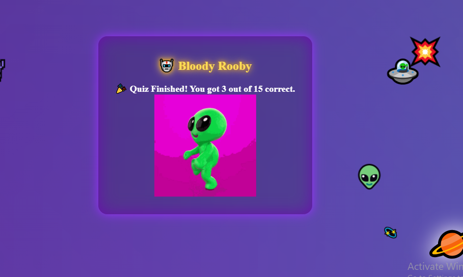
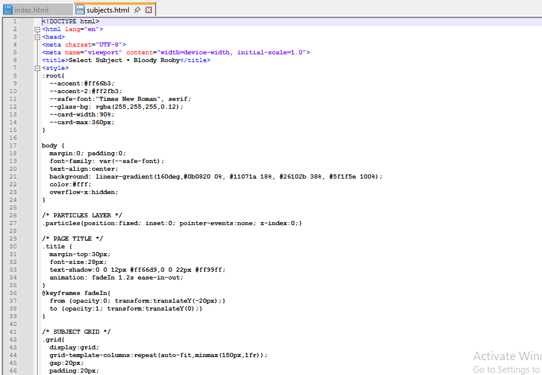
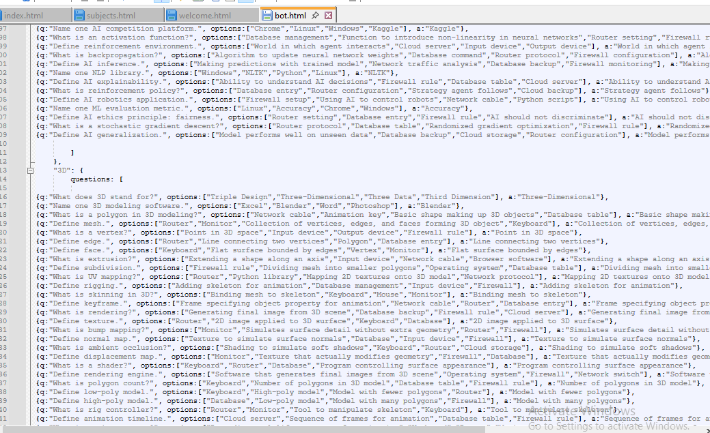

# 🛸 Bloody Rooby – Interactive Web Project

---

## 🚀 Project Overview
**Bloody Rooby** is a fully interactive web project built with **HTML, CSS, and JavaScript**, designed to provide an engaging and playful user experience.  
The project demonstrates advanced front-end skills including interactivity, animations, responsive design, and dynamic content.  

**Purpose:**  
- Showcase front-end web development abilities in a professional portfolio  
- Build a playful, interactive, and responsive web experience  
- Demonstrate clean UI/UX design and interactive elements without exposing source code  

**Key Highlights:**  
- Fully interactive and animated buttons  
- Clean and intuitive navigation  
- Responsive layout for desktops, tablets, and mobile devices  
- Safe portfolio showcase using screenshots and live demo  

---
## 🌟 Portfolio-Ready Highlights
- **Interactive UX:** Buttons and elements respond to clicks, hover, and transitions for an engaging experience.  
- **Animated Fun:** Smooth content fade-ins, bouncing elements, and Alien dance GIFs create playful interactions.  
- **Responsive Design:** Seamless layout across desktops, tablets, and mobile devices.  
- **Dynamic Navigation:** Easy-to-use navigation and section transitions with smooth scrolling.  
- **Themed Visuals:** Unique alien-inspired design with interactive mini-game elements.  
- **Optimized Performance:** Lightweight code ensures fast loading and smooth animations.  
- **Safe Portfolio Showcase:** Demonstrates interactivity and design without exposing private code.  
---
## 🎯 Features
- **Interactive Buttons:** React to clicks, hover, and transitions for immersive UX  
- **Animations & Effects:** Smooth fade-ins, bouncing elements, and GIF interactions  
- **Responsive Design:** Seamless experience across multiple devices and screen sizes  
- **Dynamic Navigation:** Easy access to different sections with smooth scrolling  
- **Playful Visuals:** Fun alien theme with animations and interactive mini-games  
- **Performance-Optimized:** Minimal use of libraries for fast loading  

---

## 🛠 Tech Stack
| Technology | Role |
|------------|------|
| HTML       | Structure and semantic layout |
| CSS        | Styling, responsive design, animations, hover effects |
| JavaScript | Button interactivity, dynamic behavior, event handling |

> The full project code is **private**; screenshots are used to showcase functionality for portfolio purposes.

---

## 📸 Screenshots Gallery
Here’s a visual walkthrough of the project:

| Screenshot | Description |
|------------|-------------|
|  | **Project Structure** – Overview of `index.html`, `style.css`, and `script.js` |
|  | **Hosting Dashboard** – InfinityFree dashboard confirming live deployment |
|  | **Homepage** – Main page layout with interactive buttons |
|  | **Go to Rooby Section** – Navigation to main interactive area |
|  | **Select Subject Page** – Users choose categories or topics before starting |
|  | **Quiz Completion** – Last stage after 15 questions |
|  | **Alien Dance GIF** – Animated interaction demonstrating playful UX |
|  | **Full Layout Preview** – Shows design consistency and structure |

---

## 🌐 Live Demo
Explore the live project here: [Bloody Rooby](https://bloodyrooby.xo.je/)

---

## 📖 Project Walkthrough
1. **Project Structure (b1)** – Shows the file hierarchy: HTML, CSS, JS, images, and assets  
2. **Hosting Dashboard (b2)** – Confirms deployment with InfinityFree  
3. **Homepage (b3)** – Displays interactive buttons, welcome layout, and instructions  
4. **Go to Rooby Section (b4)** – Main interactive area where user engagement begins  
5. **Select Subject Page (b5)** – Users pick a topic or category before starting the quiz/game  
6. **Final Interaction (b6 & b7)** – Completion page with animated Alien dance after 15 questions  
7. **Full Layout Preview (b8)** – Demonstrates clean, consistent design and navigation  

---

## 🧠 Skills & Learnings
- Designing responsive web layouts with HTML and CSS  
- Creating interactive elements using JavaScript events  
- Adding animations and hover effects for enhanced user experience  
- Deploying live projects on hosting platforms like InfinityFree  
- Documenting projects professionally for portfolio showcase  

---

## ⚡ Challenges & Solutions
**Challenges:**  
- Smooth animations across multiple browsers  
- Maintaining responsiveness on all devices  
- Showcasing interactive functionality without revealing code  

**Solutions:**  
- Implemented CSS transitions and media queries for responsiveness  
- Created GIFs and screenshots to capture all interactive features  
- Documented workflow in README for clarity and professionalism  

---

## 🔮 Future Improvements
- Add more mini-games or interactive quizzes for extended engagement  
- Implement dark/light mode toggle for user preference  
- Enhance accessibility with ARIA labels and better contrast  
- Include short video demos or GIFs for all animations  
- Introduce advanced CSS effects for more polished UI  

---

## 🎉 Conclusion
**Bloody Rooby** is a fully interactive, visually appealing, and playful web project, ideal for a **portfolio showcase**.  
It demonstrates strong **front-end development skills**, an ability to create engaging UX, and professional project documentation practices.
